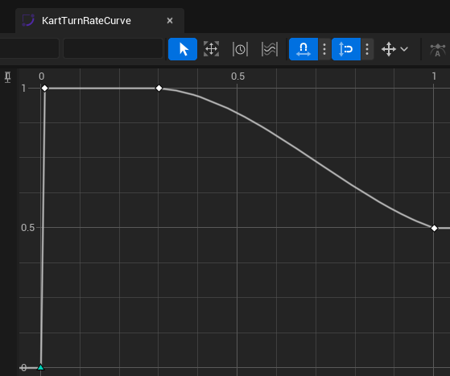
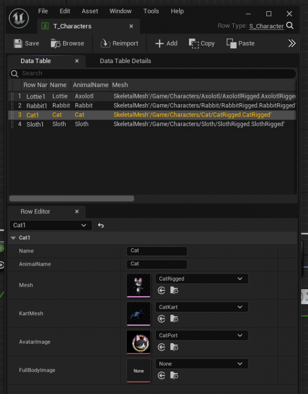

Created Feburary 2023



# [Play the game here](https://frazerbeckett.itch.io/chaos-kart)

# What is it?

- **Engine**: Unreal Engine 5
- **Language**: Blueprint

# This was a group project!

Chaos Kart was a **Group Project** that I was a part of, consisting of a team of around 15 people over six weeks in a studio environment simulation.

I specifically worked on:
- The **Kart Physics**:
  - The suspension system.
  - Steering (with the exception of wheel friction)
  - Turning curve that changes with how fast you're going.
    - Designer-adjustable with a visual curve within the editor.
- The **Character selection backend**:
  - Data structure for storing character information
  - Functions for passing selected characters to gameplay
- Boosting
- Upside-down detection and subsequent self-destruction
- Reversing

# The Kart Physics

The physics were heavily inspired by [this video](https://youtu.be/LG1CtlFRmpU) from SpaceDustStudios, who used a floating brick held up by four raycasts that acted as suspension springs and custom forces to manipulate the movement.

The advantage of this system is that we don't necessarily even need wheeled vehicles. Meshes can be swapped and the wheel models can be removed, so hovering vehicles are possible.

I replicated this solution using Blueprint and actor components.

## Suspension

First we loop through each arrow and trace lines at each of their positions:

Then we apply the appropriate suspension force based on how far the suspension is compressed:

The result is a smooth suspension that performs well over bumpy terrain and keeps the kart up:

<video width="100%" controls alt="A video showing a working model of the 'flying brick' approach.">
  <source src="prototyping.mp4" type="video/mp4">
</video>

## Steering

This is done by applying torque to the kart body. This is done with an equation that tells us how much torque we need to achieve a certain rotational speed using the size of the car's model.

## Varying Turning Circle

The turning circle of the kart gets lower the faster you go. This is easily adjustable within the editor using a Curve Float.

This is then used as a multiplier for the base turning speed:

# Character Selection Backend

There is a single BaseKart class that acts as a base for the game to modify when it is spawned in. The modifications come from a selected Character's data structure the kart gets from the GameInstance when it is possessed. The kart itself then applies the necessary changes to itself from the character data it uses.

## Data Structure

There are no differences in driving characteristics between characters, so making a structure that represents a character was easy since it was just cosmetic differences. I then made a datatable made from this structure to create the characters:

## Construction

A variable in the GameInstance called PlayerSelectedCharacters contains the names of each character that was selected:

There is some validation to check if the data received is correct when the kart is possessed. If there are any issues found within the data, or a character is not selected somehow, a random character will be given to that player.

When a character is selected, randomly or not, the driver and kart meshes are set and the box extents are derived from the kart dimensions:

# Credits

- The entirety of Team 2 for making a fantastic short game! It was hard work but we got there in the end <3
  - Gameplay designers
  - Gameplay programmers
  - Hard-surface modellers
  - Texture artists
  - Character artists
  - Environment artists
  - Concept artists
  - Art, Tech, and Design leads
