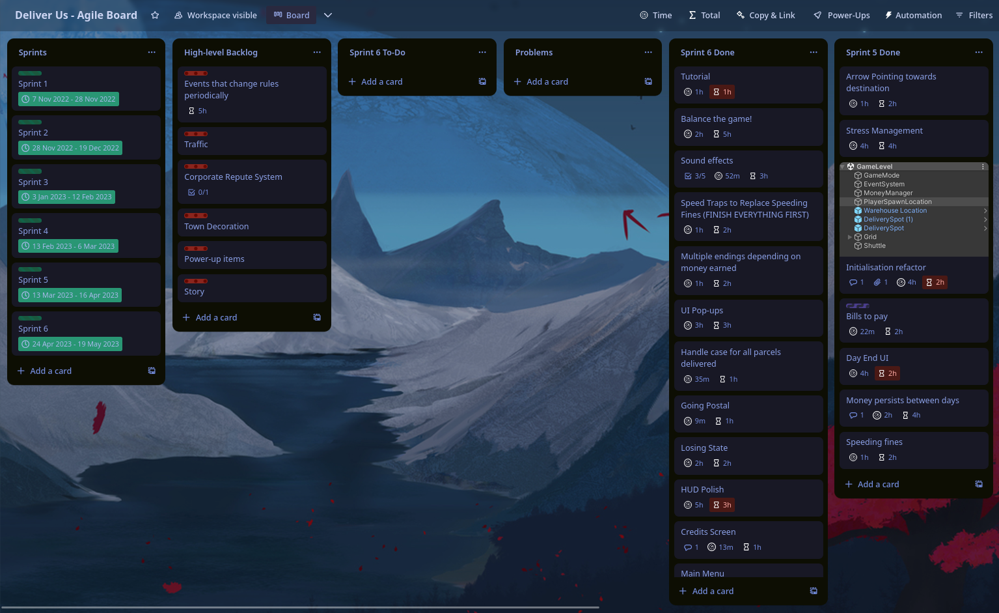
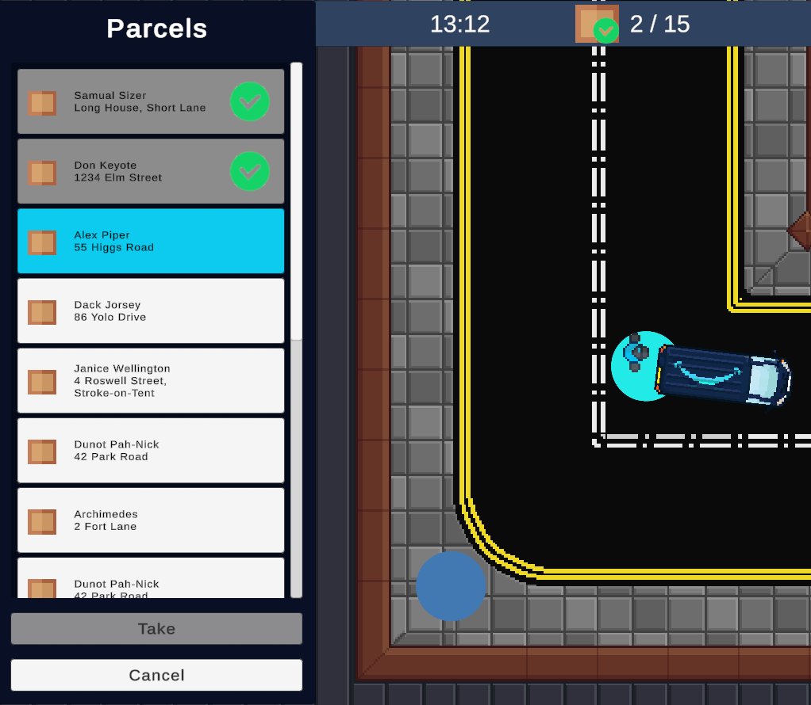
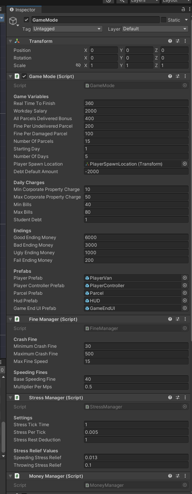
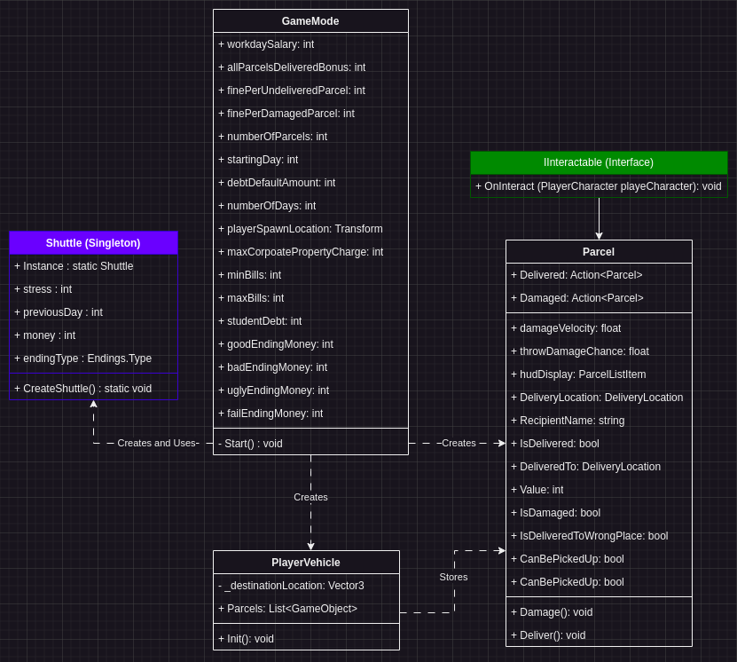

Created May 2023

<iframe id="" src="game-build" name="game" frameborder="0" marginheight="0" scrolling="no" width="100%"></iframe>

# Video


# What is it?

- **Engine**: Unity
- **Language**: C#
- **Source Code:** [Here!](https://github.com/gecko-devel/deliver-us-scripts)

 Deliver Us is a parcel delivery simulator with some dark undertones, made as part of a year-long module where the objective was to create a finished product by the end of the acedemic year. It was an exercise in project management, self discipline, and work-life balance.

 Key features:
 - Ability to pick up and throw boxes
 - Drivable van
 - Basic navigation
 - List of deliveries
 - Complete game loop
 - Resource management
 - Multiple endings

 # How was the project managed?

 The project was managed using a Trello board with a very basic workflow. By default it had a few task lists:
 - **Sprints**, which represented the progress of each sprint overall.
 - **High-level Backlog**, which represented key features of the game.
 - **Sprint X Todo**
 - **Sprint X Doing** 
 - **Sprint X Done**

 

 When a sprint was complete, I would move the "Sprint X Done" list to the side and make a new one for the next sprint, renaming the Doing and Todo lists to the new sprint number. This was to keep track of what was done in each sprint.

 Each task was individually time-managed, too. I used a Trello addon to add an estimated completion time to each task, as well as how long it actually took me. This gave me a lot of insight into how fast I work and I got better at estimating how long tasks took me to do as the project continued.

 # How does switching between the player and vehicle work?

 The project follows a design pattern similar to that in Unreal Engine's Controller/Pawn pattern, although is follows a more abstracted design where the Player Controller handles the camera too.

 The PlayerController class passes player input to a PlayerControllable instance. This is an abstract class instead of an interface.

 **PlayerController.cs:**
 ```cs
 public class PlayerController : MonoBehaviour
{
    [SerializeField] private CinemachineVirtualCamera virtualCamera;
    
    public PlayerInput PlayerInput { get; private set; }

    private PlayerControllable _target;

    public void Init()
    {
        PlayerInput = GetComponent<PlayerInput>();
    }

    public void Possess(PlayerControllable newTarget)
    {
        // Unpossess current target.
        Unpossess();
        
        // Find new target and run its bind function, passing a reference to itself.
        _target = newTarget;
        _target.Bind(this);

        // Move camera to new target's transform.
        virtualCamera.Follow = newTarget.transform;
    }

    public void Unpossess()
    {
        // If there is no target to unpossess, don't do anything.
        if (_target == null)
            return;
        
        _target.Unbind();
        _target = null;
    }
}
 ```

 **PlayerControllable.cs:**
```cs
public abstract class PlayerControllable : MonoBehaviour
{
    protected PlayerController _currentController;

    public abstract void Bind(PlayerController playerController);
    public abstract void Unbind();
}
```

The **PlayerControllable** class is then inherited by the Player**Character** and Player**Vehicle** classes, which have their own functions that define what Input Action Map the Player**Controller** should use. They bind the events of those action maps to the functions inside their classes.

**PlayerCharacter.cs:**
```cs
public class PlayerVehicle : PlayerControllable, IInteractable
{
    // [...]
    public override void Bind(PlayerController playerController)
    {
        _currentController = playerController;
        _currentController.PlayerInput.SwitchCurrentActionMap("OnFoot");
        
        _currentController.PlayerInput.currentActionMap.FindAction("Walk", true).performed += OnWalk;
        _currentController.PlayerInput.currentActionMap.FindAction("Walk", true).canceled += OnWalk;

        _currentController.PlayerInput.currentActionMap.FindAction("Interact", true).performed += OnInteract;
        _currentController.PlayerInput.currentActionMap.FindAction("Throw", true).performed += OnThrow;
    }

    public override void Unbind()
    {
        _currentController.PlayerInput.currentActionMap.FindAction("Walk", true).performed -= OnWalk;
        _currentController.PlayerInput.currentActionMap.FindAction("Walk", true).canceled -= OnWalk;

        _currentController.PlayerInput.currentActionMap.FindAction("Interact", true).performed -= OnInteract;
        _currentController.PlayerInput.currentActionMap.FindAction("Throw", true).performed -= OnThrow;
    }
    // [...]
}
```

This approach makes sure that, if needed, I can add have more ways for the player to interact with the game. I had planned initially to have more than one vehicle, for instance, which would have required a setup much like this.

# How do the parcels work?



The parcels are randomly generated at the start of the game by the GameMode, sticking to a similar architecture to Unreal Engine. The GameMode is the game object that initialises everything in the scene in a specific order and spawns the player vehicle with the generated parcels in its inventory. This gives the GameMode a lot of control over how objects are initialised and allows it to pass references to objects that would otherwise need to do recursive searches through the scene tree.



Different game elements are broken into separate scripts so that they can be added or removed as needed, in case I wanted to expand the game into a more arcade feel later on.

The parcels are generated after the delivery locations are all found and initialised, so that the GameMode knows all the possible places a parcel can go:

**GameMode.cs:**
```cs
private void Start()
{
    // Create shuttle if needed
    // The shuttle is the object that stores money, stress, and other varialbes between scenes.
    if (Shuttle.Instance == null)
        Shuttle.CreateShuttle();

    // [...]
    
    // Spawn player controller
    _playerController = Instantiate(playerControllerPrefab).GetComponent<PlayerController>();
    _playerController.Init();
    
    // Spawn player
    GameObject player = Instantiate(playerPrefab, playerSpawnLocation.position, playerSpawnLocation.rotation);
    _playerVehicle = player.GetComponent<PlayerVehicle>();
    _playerController.Possess(_playerVehicle);
    _playerVehicle.AllParcelsDelivered += OnAllParcelsDelivered;

    // [...]

    // This is fine because they are all the same.
    _warehouseParkingLocation = FindObjectOfType<WarehouseParkingLocation>();
    WarehouseParkingLocation.WarehouseVisited += OnWarehouseVisited;

    // Get all delivery locations in level and subscribe to their events
    _deliveryLocations.AddRange(FindObjectsOfType<DeliveryLocation>());

    // Add parcels to inventory
    for (int i = 0; i < numberOfParcels; i++)
    {
        GameObject parcel = GenerateParcel();
        parcel.GetComponent<Parcel>().Delivered += OnParcelDelivered;
        _playerVehicle.Parcels.Add(parcel);
        _playerVehicle.StoreParcel(parcel);
    }

    // Init player
    _playerVehicle.Init();
    
    // [...]
}
```

Here is a UML diagram of the process:



# Credits

All art was done by [Dion Wilson](https://www.artstation.com/artwork/zDE1V2)! Check out his other work [here](https://www.artstation.com/dion_wilson).

- "car door slam" sound - theshaggyfreak @ Freesound.org via CC BY 4.0
- "Cash Register" sound - kiddpark @ Freesound.org via CC BY 4.0
- "camera_snap1.wav" sound - thecheeseman @ Freesound.org via CC BY 4.0
- "Night on the Docks - Sax" Kevin MacLeod (incompetech.com) Licensed under [Creative Commons: By Attribution 4.0 License](http://creativecommons.org/licenses/by/4.0/)
- "Miami Nights - Extended Theme" Kevin MacLeod (incompetech.com) Licensed under [Creative Commons: By Attribution 4.0 License](http://creativecommons.org/licenses/by/4.0/)